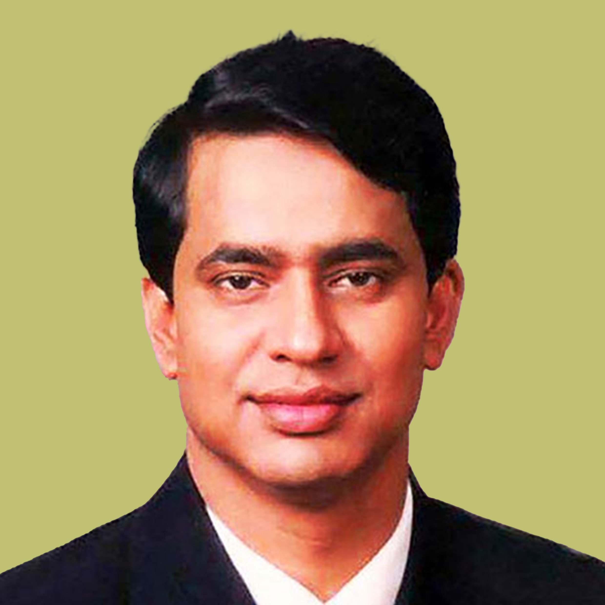

# Pendiri Ekosistem – Xhyre

<table data-view="cards"><thead><tr><th>Name</th><th>Position</th></tr></thead><tbody><tr><td>Md Abul Mansur</td><td>Managing Director – UK based</td></tr><tr><td>Bradley Prentice</td><td>Chief Executive Officer – UK Based</td></tr><tr><td>Ferdous Ahmed</td><td>SVP - Strategic Partnership – UK Based</td></tr></tbody></table>

<figure><figcaption>
Seorang pria yang tanpa henti berusaha mendorong batas-batas Deeptech. Perspektif dangkal semacam ini menghalangi sumber daya dan dana yang diperlukan untuk menerapkan Kecerdasan Buatan sebagai bagian penting dari kehidupan kita," tambah Abul Mansur. Dia masih terikat untuk memanfaatkan potensi sebenarnya dari Kecerdasan Buatan. Sepertinya R&#x26;D pada kecerdasan buatan hanya menggores permukaan. Fokus utama Abul Mansur adalah pada DeepTech yang sangat berarti Kecerdasan Buatan. Setelah membantu yang terpinggirkan, dia berupaya mengintegrasikan kecerdasan buatan dalam transaksi sehari-hari, seperti pemindahan Aset. Proyek masa depan terbesar bahwa dia sudah berinvestasi mungkin menjadi salah satu perubahan terbesar yang pernah dilihat dunia dan itu berputar di sekitar Mata Uang Digital yang Dipimpin Negara, didukung oleh Nuspay.
</figcaption></figure>

 

<figure><figcaption>
Bradley Prentice bergabung dengan XHYRE sebagai CEO pada tahun 2021 dengan berakhirnya Pengalaman 20 tahun dalam peran senior terkait perbankan layanan, industri pembayaran, dan startup. Sebelum bergabung dengan XHYRE, Bradley memimpin Bisnis Peran pembangunan di NCR di Sydney, Australia, global perusahaan teknologi pembayaran, di mana dia berhasil memimpin sektor perhotelan perusahaan untuk ANZ/SP wilayah. Sebelumnya, ia juga menjabat sebagai pendiri anggota dan Wakil Presiden Senior, Perusahaan Pengembangan untuk startup Singapura yang sukses Cepat. Dia sebelumnya menghabiskan 19 tahun dengan orang Amerika Ekspresikan dan memegang peran senior dengan Irdeto dan Ingenico di Asia Pasifik. Bradley adalah eksekutif berpengalaman dengan track record mengembangkan dan memimpin berkinerja tinggi tim di ruang terkait pembayaran, sambil mendukung bisnis ini melalui tahap transisi dan pertumbuhan.
</figcaption></figure>

 

<figure><figcaption>
Ferdous Ahmed adalah seorang profesional berpengalaman dengan lebih dari 10 pengalaman bertahun-tahun di perusahaan rintisan di bidang telekomunikasi, perawatan Kesehatan dan ruang e-commerce. Dalam peran sebelumnya, dia melayani dalam berbagai peran mulai dari pengalaman pelanggan hingga strategis kemitraan, dan dikenal untuk mendorong pertumbuhan merek, memaksimalkan keunggulan operasional dan membangun kemitraan strategis. Ferdous memegang gelar MBA dari Sekolah Manajemen Rotman, Universitas Toronto dan gelar Bachelor of Arts di bidang Ekonomi dari Universitas Texas di Austin.
</figcaption></figure>

