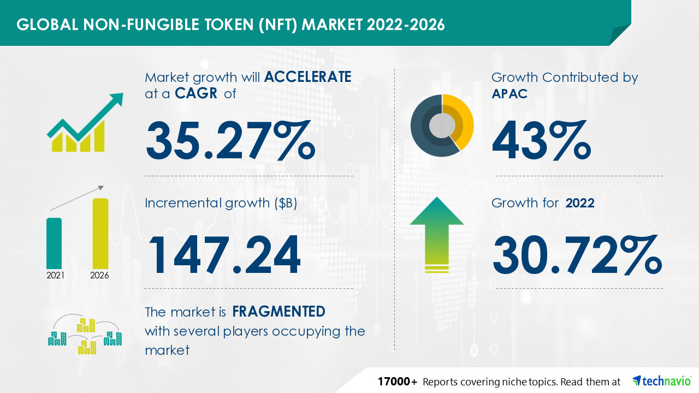

# Tentang Cryptocurrency & NFT

Cryptocurrency, crypto-currency, atau crypto adalah mata uang digital yang dirancang untuk bekerja sebagai media pertukaran melalui jaringan komputer yang tidak bergantung pada otoritas pusat mana pun, seperti pemerintah atau bank, untuk menegakkan atau mempertahankannya.

NFT adalah token yang tidak dapat dipertukarkan (NFT), yang umumnya dibuat menggunakan jenis pemrograman yang sama dengan yang digunakan untuk mata uang kripto. Secara sederhana, aset kriptografi ini didasarkan pada teknologi blockchain. Mereka tidak dapat ditukar atau diperdagangkan secara setara seperti aset kriptografi lainnya.&#x20;



Menurut studi Mckinsey & Company baru-baru ini, Indonesia telah melampaui dunia dalam adopsi digital dan memiliki skor pertumbuhan adopsi digital tertinggi pada 2014-2017 sebesar 99%, mengungguli negara lain termasuk India, Korea Selatan, Inggris, dan AS.

Google dan Temasek telah menerbitkan laporan tentang ekonomi internet Asia Tenggara pada tahun 2019 berjudul eConomy SEA 2019. Indonesia adalah salah satu dari dua pemimpin di kawasan ini dengan tingkat pertumbuhan lebih dari 40% per tahun. Ini mencapai $40 miliar pada tahun 2019 dan siap tumbuh menjadi $130 miliar pada tahun 2025.

Indonesia adalah rumah bagi masyarakat yang sebagian besar berbasis uang tunai, dan sebagian besar penduduk hingga 80% tetap tidak memiliki rekening bank. Namun, adopsi teknologi setiap hari semakin terlihat. Pada 2019, nilai transaksi uang elektronik melonjak tajam 207% menjadi Rp 145,2 triliun. Hampir 9 dari 10 pengguna internet di Indonesia menggunakan dompet digital.

Industri Blockchain dan Aset Kripto berkembang pesat di Indonesia selama 5 tahun terakhir. Diperkirakan pedagang di Indonesia telah mencapai jumlah yang signifikan, lebih dari 1,5 juta pedagang pada tahun 2020. Tumbuh setidaknya 2,263% sejak tahun 2015 dimana terdapat 152 proyek yang diperdagangkan di Indonesia.

Pada September 2018, Kementerian Perdagangan Republik Indonesia telah melegalkan perdagangan Bitcoin dan aset kripto sebagai komoditas di Indonesia. BAPPEBTI pada tahun 2019 telah mengeluarkan peraturan agar bursa cryptocurrency dapat beroperasi secara legal di Indonesia. Ini pertanda baik bahwa pemerintah Indonesia menyambut baik pertumbuhan industri kripto di Indonesia. Dimana pada akhir tahun 2020 (Q3) transaksi crypto di Indonesia sebesar Rp 22,671 Triliun.

<figure><figcaption></figcaption></figure>



Ini mirip dengan membandingkan investor dan pedagang. Semua pedagang, berinvestasi, tetapi tidak semua investor, berdagang. Perhatikan bahwa sebagian besar pengguna cryptocurrency biasanya memiliki koin dan token.

Ketika Bitcoin pertama kali keluar, itu menetapkan standar untuk apa artinya menjadi koin. Ada kualitas jelas yang membedakan koin kripto dari token, yang mirip dengan uang dunia nyata.

Koin ditentukan oleh karakteristik berikut:

1\. Beroperasi di blockchain-nya.

Blockchain melacak semua transaksi yang melibatkan koin crypto nyata.

Saat Anda membayar seseorang dengan Ethereum, tanda terima masuk ke blockchain Ethereum. Jika orang yang sama membayar Anda kembali nanti dengan Bitcoin, tanda terima masuk ke blockchain Bitcoin. Setiap transaksi dilindungi oleh enkripsi dan dapat diakses oleh setiap anggota jaringan.

2\. Bertindak sebagai uang.

Bitcoin diciptakan dengan satu-satunya tujuan menggantikan uang tradisional. Daya tarik paradoks transparansi dan anonimitas mengilhami penciptaan koin lainnya, termasuk ETH, NEO, dan Litecoin.

Anda dapat membeli barang dagangan dan layanan dari banyak perusahaan besar saat ini, seperti Amazon, Microsoft, dan Tesla, menggunakan koin kripto. Bitcoin baru-baru ini menjadi mata uang resmi El Salvador bersama dolar AS.

3\. Dapat ditambang.

&#x20;

Anda bisa mendapatkan koin kripto dengan dua cara. Salah satunya melalui penambangan tradisional dengan sistem Proof of Work. Pemburu Bitcoin menggunakan metode ini untuk meningkatkan penghasilan mereka. Masalahnya adalah tidak banyak Bitcoin yang tersisa untuk ditambang, sehingga prosesnya menjadi semakin sulit setiap hari.

Metode lainnya adalah Proof of Stake, yang merupakan pendekatan yang lebih modern untuk mendapatkan koin. Ini lebih ringan pada konsumsi energi dan lebih mudah dilakukan. Cardano adalah salah satu koin terbesar yang mengadopsi sistem ini.

Tidak seperti koin, token tidak memiliki blockchain. Sebaliknya, mereka beroperasi pada blockchain koin kripto lainnya, seperti Ethereum. Beberapa token yang paling sering terlihat di Ethereum antara lain BAT, BNT, Tether, dan berbagai stablecoin seperti USDC.

Jika transaksi koin kripto ditangani oleh blockchain, maka token bergantung pada kontrak pintar. Mereka adalah serangkaian kode yang memfasilitasi perdagangan atau pembayaran antar pengguna. Setiap blockchain menggunakan kontrak cerdasnya. Misalnya, Ethereum menggunakan ERC-20, dan NEO menggunakan Nep-5.

Saat token dihabiskan, secara fisik berpindah dari satu tempat ke tempat lain. Contoh bagusnya adalah perdagangan NFT (atau non-fungible token). Itu adalah barang unik, jadi perubahan kepemilikan harus ditangani secara manual. NFT seringkali hanya membawa nilai sentimental atau artistik, jadi NFT mirip dengan token utilitas, kecuali bahwa Anda tidak memerlukan layanan apa pun.

Ini berbeda dari koin karena koin crypto tidak bergerak; hanya saldo akun yang berubah. Saat Anda mentransfer uang dari bank Anda ke bank orang lain, uang Anda tidak akan kemana-mana. Bank menambah saldo kedua akun dan mempertahankan biaya. Hal yang sama terjadi dengan blockchain - saldo di dompet Anda berubah, dan transaksi mencatatnya.

Perbedaan penting lainnya antara token dan koin adalah apa yang mereka wakili. Sementara koin crypto pada dasarnya adalah versi digital dari uang, token dapat mewakili aset atau perbuatan.

Anda dapat membeli token dengan koin, tetapi beberapa token dapat memiliki nilai lebih dari apa pun. Misalnya, saham perusahaan. Namun, karena biasanya ada batasan di mana Anda dapat membelanjakan token, itu tidak memiliki likuiditas yang ditawarkan koin.



NFT berarti token yang tidak dapat dipertukarkan (NFT), yang umumnya dibuat menggunakan jenis pemrograman yang sama dengan yang digunakan untuk mata uang kripto. Secara sederhana, aset kriptografi ini didasarkan pada teknologi blockchain. Mereka tidak dapat ditukar atau diperdagangkan secara setara seperti aset kriptografi lainnya.

Seperti Bitcoin atau Ethereum. Istilah NFT dengan jelas menyatakan bahwa itu tidak dapat diganti atau dipertukarkan karena memiliki sifat unik. Mata uang fisik dan cryptocurrency dapat dipertukarkan, yang berarti bahwa mereka dapat diperdagangkan atau ditukar satu sama lain.

NFT berevolusi dari standar ERC-721. Dikembangkan oleh beberapa orang yang sama yang bertanggung jawab atas kontrak cerdas ERC-20, ERC-721 menentukan antarmuka minimum—detail kepemilikan, keamanan, dan metadata—yang diperlukan untuk pertukaran dan distribusi token game. Standar ERC-1155 mengambil konsep lebih jauh dengan mengurangi biaya transaksi dan penyimpanan yang diperlukan untuk NFT dan menggabungkan beberapa jenis token yang tidak dapat dipertukarkan ke dalam satu kontrak.

NFT juga dapat mendemokratisasi investasi dengan memecah aset fisik seperti real estat. Jauh lebih mudah membagi aset real estat digital di antara banyak pemilik daripada aset fisik. Etika tokenisasi itu tidak perlu dibatasi pada real estat; itu dapat meluas ke aset lain, seperti karya seni. Jadi, sebuah lukisan tidak harus selalu memiliki satu pemilik. Setara digitalnya dapat memiliki banyak pemilik, masing-masing bertanggung jawab atas sebagian kecil dari lukisan itu. Pengaturan seperti itu dapat meningkatkan nilai dan pendapatannya.

<figure><figcaption></figcaption></figure>


