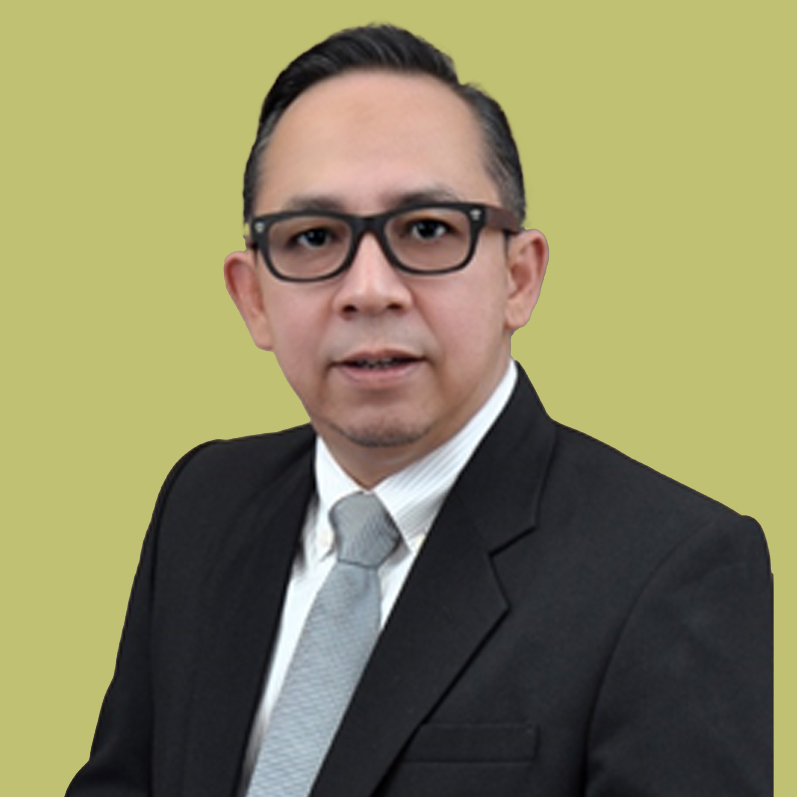
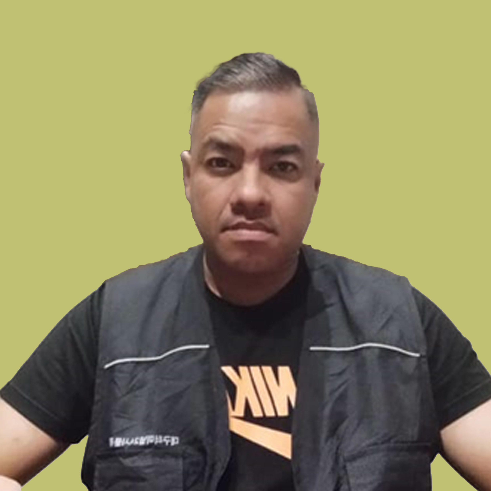
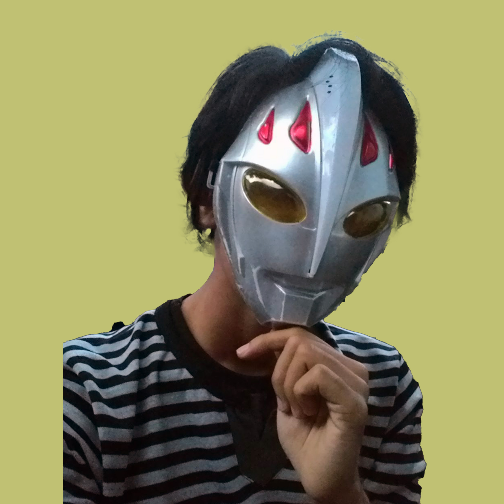

# Tentang Kami – NFT-Proland

<table data-view="cards"><thead><tr><th>Name</th><th>Position</th></tr></thead><tbody><tr><td>Irwan Darmawan, Ir. CIB®</td><td>Vice-President of Regional Indonesia – Indonesia Based</td></tr><tr><td>Rengge Luciano</td><td>VP Marketing Regional Indonesia – Indonesia Based</td></tr><tr><td>Imagine Dragon</td><td>VP Technology Regional Indonesia – Indonesia Based</td></tr></tbody></table>

<figure><figcaption>
Berpengalaman di Investment Banking, Corporate Finance, Underwriter, Komite Audit di Pasar Modal dan Industri Tertentu di Indonesia lebih dari 20 tahun. Selama menjalankan tugasnya, beliau juga memiliki spesialisasi di Industri Minyak &#x26; Gas, Petrokimia, Pertambangan Emas, IT dan Telekomunikasi, serta Produk Konsumen dan Penasihat UKM untuk LSM. Dia juga memiliki pengalaman untuk Reg.S/144A ketika dia melakukan Global Bonds perdana senilai USD 1,5 Miliar untuk Perusahaan Minyak Nasional Indonesia serta Protokol Pasar Modal Indonesia. Dia melakukan dan berkoordinasi dengan Perusahaan Bank Investasi regional dan global, Dana Ekuitas Swasta dan Profesional Penunjang karena memenuhi tugasnya. Beliau juga berpengalaman sebagai CFO dan Direktur di beberapa Perusahaan Tercatat di Indonesia khususnya untuk restrukturisasi dan penciptaan nilai bagi perusahaan. Lulus dari Sarjana Teknik Industri dan Manajemen, Institut Teknologi Nasional, Bandung dan memiliki Kompetensi Manajer Investasi di Pasar Modal Indonesia, Kompetensi Terdaftar Indonesia Certified Investment Banking (CIB®), Wakil Penjamin Emisi, Anggota Komite Audit Indonesia (IKAI), dan lainnya ramalan organisasi di Pasar Modal Indonesia.
</figcaption></figure>

 

<figure><figcaption>
Berpengalaman di dunia Pemasaran, Event organizer, dan Pelatihan di Indonesia lebih dari 15 tahun. Selama menjalankan tugasnya, beliau berhasil mengsukseskan penjualan produk elektronik dalam jumlah besar dan menempati peringkat no. 1 sebagai pemasar produk pada beberapa perusahaan ternama di Indonesia. Beliau juga telah berhasil membantu mengsukseskan beberapa event entertainment dan politik. Beliau memiliki banyak jaringan komunitas dari Sabang sampai Merauke.
</figcaption></figure>

 

<figure><figcaption>
Memiliki pengalaman membangun ekosistem lebih dari 5x sejak tahun 2015, dan sampai saat ini masih memiliki komunitas token yang loyal. Beliau yang membangun Token NPL, membuat Whitepaper Token NPL dan mendistribusikan Token NPL.
</figcaption></figure>

